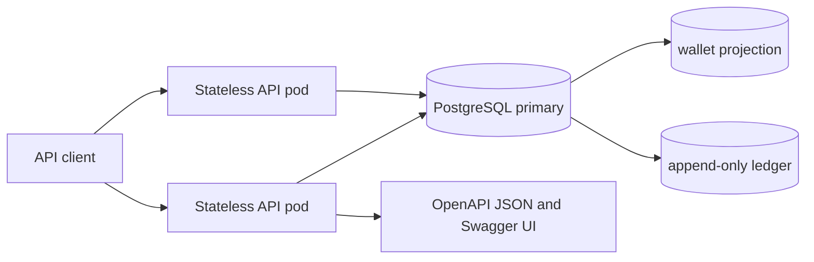
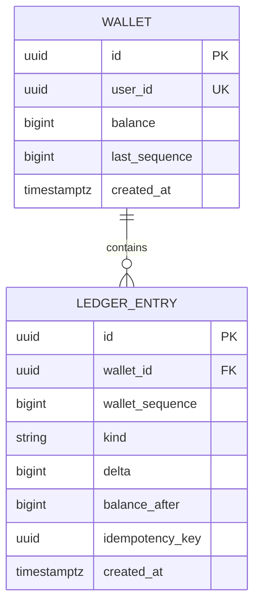

# Auditable Wallet: Technical Specification

Status: **discussion draft** (2026-10-04). This document defines the proposed implementation; no application code is authorized by this step.

## 1. Goal and source of requirements

Build a small wallet service for an interview exercise with roughly three days of implementation time. The supplied assignment asks for credit, debit, current balance, and complete change history. It requires no negative balance, a separate record for each balance change, a balance reconstructible from recorded changes, no partial effects for invalid or failed requests, and defined behavior for a retried request. It asks for runnable code, documented assumptions, and tests covering sequential changes, insufficient funds, retry, and rollback.

The candidate's additional requirements are an append-only ledger, OpenAPI/Swagger documentation, a simple horizontally scalable design, concurrency safety across pods, and clear behavior during network partitions. The assignment prefers Python/Django; this specification describes behavior and data invariants independently of language. Django plus PostgreSQL is the proposed implementation stack, not a requirement of the domain model.

### Scope

- One wallet per user and one fixed currency for the exercise; all amounts are integer minor units (for example, cents), stored as signed 64-bit integers. The currency code is configured for the whole deployment and included in API responses. This avoids floating-point rounding and avoids foreign exchange rules.
- Credits are internal bookkeeping commands. No payment provider, bank settlement, or external success callback is modeled.
- The service creates a wallet explicitly, then accepts credits and debits. No transfer, hold, reversal, admin balance edit, user registration, or multi-currency operation is included.
- A demo caller supplies a user identifier; authentication and ownership checks are outside the exercise. This is an explicit deployment limitation, not a claim that the API is safe to expose publicly.

The scope bullets above are **working assumptions awaiting the candidate's confirmation**. If the intended scope differs, update this section and its affected API/data model before implementation.

## 2. Invariants and consistency model

1. For each wallet, `balance = SUM(ledger.delta)` over all committed entries; an empty ledger sums to zero.
2. `0 <= balance <= 2^63 - 1` after every committed operation. Amounts are positive integers in minor units; zero, fractions, negative values, and values outside the 64-bit range are rejected.
3. Exactly one committed ledger row represents each successful credit or debit. The row records its signed delta, operation, wallet sequence, request key, and resulting balance. Ledger rows are never updated or deleted through application operations.
4. Wallet balance and sequence are a derived, mutable projection for fast reads. A change to this projection and the corresponding ledger append commit in one PostgreSQL transaction or neither does. The ledger remains sufficient to reconstruct and verify the projection.
5. A `(wallet_id, idempotency_key)` names one mutation intent. Repeating the same key and same canonical command returns the original result and makes no second change. Reusing the key with different content is a conflict.
6. All successful operations on one wallet have a total order given by `wallet_sequence`. A read from the primary after a successful write sees that write. History pagination preserves this order.

This is a **single-entry wallet ledger**, not full double-entry accounting. It tracks the exercise's internal wallet changes. A production money movement system would need counterparty accounts and reconciliation with the external source of funds.

## 3. High-level design



API pods hold no wallet state. PostgreSQL is the only coordination and durability boundary. All mutation and consistency-sensitive read queries use the primary. A deployment may add more API pods without changing the locking protocol. PostgreSQL itself remains a single writable primary; this design does not promise writes during loss of that primary or during a network partition.

### Decisions and trade-offs

| Decision | Reason | Cost / limit |
| --- | --- | --- |
| PostgreSQL transaction and row lock per wallet | Serializes debits across pods and makes the ledger/projection update atomic | Concurrent writes to the same wallet queue; this is acceptable for the exercise |
| `READ COMMITTED` isolation plus `SELECT ... FOR UPDATE` | Sufficient for a single-wallet mutation when every writer follows the protocol | A new code path that bypasses the lock could violate the invariant |
| Stored balance projection | Constant-time balance reads and pre-debit checks; rebuildable from entries | Redundant state requires reconciliation tests and an operational repair path |
| Integer minor units in `BIGINT` | Exact arithmetic and simple validation | Fixed scale/currency; overflow must be checked explicitly |
| Persistent idempotency key on ledger row | Makes a retry safe even if the first response is lost | Clients must generate and retain stable keys; keys are retained with ledger history |
| Cursor-based history | Stable, efficient traversal as entries grow | Client must follow cursors; no offset-based random page access |
| No queue/cache/distributed lock | Keeps the consistency story small and reviewable | Database availability and throughput bound the service |

## 4. Data model



`wallet` constraints: `UNIQUE(user_id)`, `CHECK(balance >= 0)`, `CHECK(last_sequence >= 0)`. `ledger_entry` constraints: `UNIQUE(wallet_id, wallet_sequence)`, `UNIQUE(wallet_id, idempotency_key)`, `CHECK(delta <> 0)`, `CHECK(balance_after >= 0)`, and a sign check matching `kind` (`credit` positive, `debit` negative). `wallet_id` has a restrictive foreign key: wallet deletion is not part of this API. The history query uses an index on `(wallet_id, wallet_sequence DESC)`.

`balance_after` and the next sequence number are computed while holding the wallet lock. The command fingerprint is the tuple `(kind, amount)` after strict input parsing. For this small API, comparing these fields on an existing entry is sufficient; an opaque payload hash is unnecessary. Timestamps are audit metadata, not an ordering mechanism. A migration installs a database guard rejecting `UPDATE` and `DELETE` on `ledger_entry` for the application role; administrative migration/repair privileges are separate. This is logical append-only behavior, not cryptographic tamper evidence.

One wallet is created with `balance = 0` and `last_sequence = 0`. The first entry has sequence `1`. A missing wallet never implicitly appears during a balance or mutation request.
Concurrent create requests for the same `user_id` resolve through the unique constraint (for example, insert-on-conflict followed by a read), returning the same wallet without replacing its balance.

## 5. API contract

The implementation publishes OpenAPI 3.x at `GET /openapi.json` and interactive Swagger UI at `GET /docs`. Those endpoints describe the schemas, required idempotency header, examples, and error responses below. The API returns JSON, uses UUIDs for identifiers, and sends decimal integer JSON numbers for amounts. Clients must avoid JavaScript number precision loss above `2^53 - 1`; the OpenAPI schema should document this, and a string representation can be chosen before implementation if browser clients are required.

| Method and path | Request | Success |
| --- | --- | --- |
| `PUT /v1/wallets/{user_id}` | No body | `200`, wallet with `balance: 0` when created; repeat returns existing wallet without resetting it |
| `POST /v1/wallets/{user_id}/credits` | `Idempotency-Key: <UUID>` and `{ "amount": 1250 }` | `201`, entry with `kind`, `amount`, `balance_after`, `wallet_sequence`, `created_at` |
| `POST /v1/wallets/{user_id}/debits` | Same shape | `201`, same entry shape |
| `GET /v1/wallets/{user_id}` | None | `200`, wallet ID, user ID, currency, current balance, last sequence |
| `GET /v1/wallets/{user_id}/entries?limit=50&cursor=...` | Optional limit and cursor | `200`, newest-first entries and `next_cursor`; following cursors yields full history |

`PUT` is creation-only and idempotent. It never changes an existing balance. The status remains `200` for both creation and a repeat to keep the contract simple. The user identifier is a caller-supplied UUID in this exercise.

An entry response includes `id`, `wallet_id`, `kind`, `amount` (positive), `delta` (signed), `balance_after`, `wallet_sequence`, `created_at`, and `currency`. A replay returns the **same status and body** as the original committed mutation; an optional `Idempotency-Replayed: true` header may be added. The key is scoped to one wallet and shared across credit and debit commands, so the same key cannot silently change operation type.

History uses an opaque cursor containing the next exclusive sequence boundary and the first page's upper sequence boundary. `limit` is 1..100, default 50. Entries are returned in descending `wallet_sequence`; concurrent new entries appear on a fresh traversal, not midway through an existing one. A cursor cannot be used for another wallet. The server validates the cursor and returns `400` if malformed or mismatched. No history row is returned for a failed mutation.

### Errors and validation

All errors have `{ "error": { "code": "...", "message": "..." } }`; messages are stable enough to explain the error, while clients branch on `code`.

| Status | Code | Case |
| --- | --- | --- |
| `400` | `invalid_request` | Malformed JSON, unknown fields, missing/invalid UUID key, non-integer amount, zero/negative amount, invalid cursor/limit |
| `404` | `wallet_not_found` | Balance, history, credit, or debit for a missing wallet |
| `409` | `insufficient_funds` | Debit exceeds locked current balance |
| `409` | `idempotency_conflict` | Same key with different operation or amount |
| `422` | `amount_out_of_range` | Positive amount cannot fit `BIGINT`, or credit would overflow balance |
| `503` | `storage_unavailable` | Database unavailable, lock timeout, or retryable database conflict exhausted; caller retries with the same key |

No mutation is attempted after a validation failure. A debit with insufficient funds does not reserve its idempotency key, so a later attempt with the same key can succeed after a credit; this behavior must be documented in OpenAPI. If a request times out after its commit status becomes unknown, the client retries with the same key instead of generating a new one.

## 6. Write path and concurrency

For a credit or debit, the service performs the following as **one database transaction**:

1. Strictly parse user UUID, idempotency UUID, operation, and amount before opening the transaction.
2. Load the wallet row with an exclusive row lock. If absent, return `404`.
3. Look up the ledger row for `(wallet_id, idempotency_key)`. If found, compare `(kind, amount)` and return its original result or `409`; do not modify any row.
4. Check insufficient funds or overflow using the locked wallet balance.
5. Increment the wallet's sequence; update its balance; insert exactly one ledger row with the new sequence and `balance_after`.
6. Commit before returning success. Any exception before commit rolls back both changes.

```mermaid
sequenceDiagram
    participant A as API pod A
    participant B as API pod B
    participant D as PostgreSQL
    A->>D: BEGIN; lock wallet
    B->>D: BEGIN; lock same wallet (wait)
    A->>D: check key/funds; update wallet; append entry; COMMIT
    D-->>B: wallet lock acquired with current balance
    B->>D: check key/funds against committed state
    B->>D: append+update or rollback; COMMIT
```

Two simultaneous debits cannot both spend the same funds: the second checks the balance only after the first commits or rolls back. Identical concurrent idempotency keys serialize on the same wallet lock; the second reads the committed first entry and replays it. The unique constraints are a final backstop. The only financial lock acquired is one wallet row. Future multi-wallet operations must lock wallet IDs in a deterministic order to avoid deadlocks; they are outside this exercise. A genuine PostgreSQL deadlock (`40P01`) or serialization error (`40001`) is retried a small bounded number of times with jitter and the same key. If exhausted, return `503` without asserting that a commit did or did not happen.

The app does not send an HTTP success before commit. A connection loss around `COMMIT` leaves the caller uncertain even if the database committed; replay resolves this ambiguity. No application-level lock or pod-local cache may decide balance.

## 7. Partition and recovery behavior

- If a pod loses the primary database, it cannot accept writes or return an authoritative current balance. It returns `503` when possible; a broken client connection may receive no response. The client retries mutations with the original idempotency key.
- If the client loses contact with a pod after submitting a request, retrying through another pod is safe because the key and committed ledger live in PostgreSQL.
- The service favors consistency over write availability during database partitions. It has no multi-primary mode or automatic reconciliation of divergent databases. PostgreSQL failover, backups, and restoration are deployment responsibilities; the API resumes against one designated writable primary.
- Any primary replacement must fence the former writer. Promoting an asynchronous replica can lose an acknowledged commit, so seamless failover with zero committed-data loss is **not** a guarantee of this exercise. The simplest deployment keeps one primary and restores from a known durable backup after catastrophic database loss.
- On startup or maintenance, an operator can compare each wallet's stored `balance` and `last_sequence` with ordered ledger entries. A mismatch is an integrity incident. Any repair must be an explicit, audited administrative procedure, never an automatic silent rewrite on a read path.

The intended guarantee is atomic, ordered wallet changes while a single PostgreSQL primary is available, plus safe client retries after uncertain responses. It is not uninterrupted availability under all partitions.

## 8. Implementation shape and verification plan

Suggested modules, independent of language: HTTP/schema layer; wallet command service; read/query service; persistence models/migrations; database transaction helper; OpenAPI document; focused tests. In Django, the command service owns the transaction and row lock, while views only parse requests and map domain errors to HTTP. Use PostgreSQL in concurrency tests; SQLite does not reproduce the locking semantics.

Required tests:

1. Create wallet; multiple sequential credits and debits; assert current balance, exact entry sequence, and `SUM(delta)` equality.
2. Debit more than the available balance; assert `409`, no ledger row, and unchanged balance/sequence.
3. Repeat a successful credit and debit with the same key; assert the original response and exactly one change. Reuse a key with another amount or operation; assert conflict.
4. Run two debits concurrently against one wallet through separate database connections, with combined amount exceeding funds; exactly one succeeds and balance never goes negative.
5. Force an error after the wallet update but before the ledger insert/commit; assert rollback leaves both wallet and ledger unchanged.
6. Exercise retry after a simulated lost response, history pagination during concurrent append, amount overflow, malformed inputs, and a missing wallet.
7. Rebuild balance and sequence from the ledger in a test to prove the projection invariant. Validate the served OpenAPI document and use it to check representative requests/responses.

Keep the runnable delivery small: one service, one database, migration scripts, documented local startup, Swagger UI, and the above tests. Defer external payment integration, authentication, distributed queues, cache, replicas, transfers, and operational high-availability automation unless the candidate changes scope.

## 9. Open decisions for review

1. Confirm whether credits are internal adjustments or confirmed external deposits. The latter requires an external event identity and a different trust boundary.
2. Confirm whether caller-supplied user IDs without authentication are acceptable for the exercise. If authentication is required, define the identity source and ownership rule.
3. Confirm one wallet and one currency per user, with no transfers. More currencies or transfers change the data model and lock ordering.
4. Confirm the unit and currency code (for example, USD cents). Until then, `BIGINT` means fixed minor units and the code is deployment configuration.
5. Confirm whether the API must support browser JavaScript clients that cannot safely represent all signed 64-bit JSON numbers. If so, encode monetary integers as decimal strings in the API while retaining `BIGINT` in PostgreSQL.
