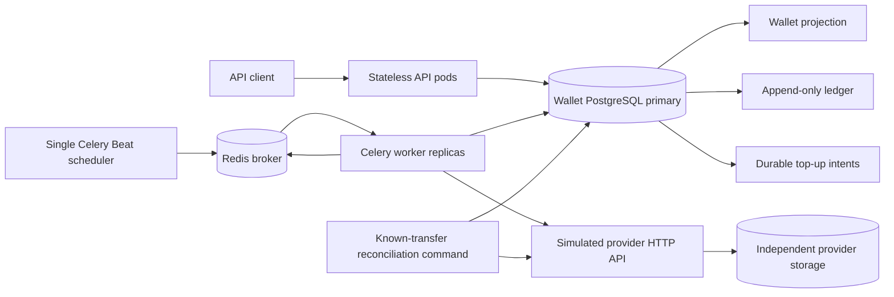
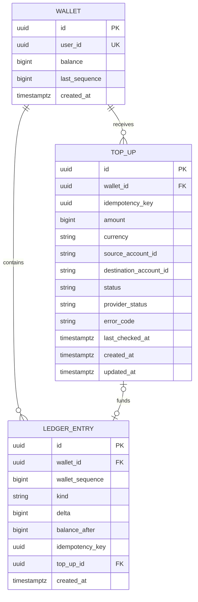

# Auditable Wallet: Technical Specification

Status: **implementation approved and delivered** (2026-10-04). The candidate explicitly authorized implementation after the design review. See [the README](../README.md) for startup, API documentation, and verification commands.

## 1. Goal and scope

Build a small wallet service for an interview exercise with roughly three days of implementation time. The supplied assignment requires credit, debit, current balance, and complete change history; no negative balance; a separate record for each change; a balance verifiable from recorded changes; atomic failure handling; and defined retry behavior. It asks for runnable code, documented assumptions, and tests for sequential changes, insufficient funds, retries, and rollback.

The candidate additionally requires an append-only ledger, OpenAPI/Swagger documentation, concurrency safety across pods, and resilience during network partitions. Simplicity of implementation is the primary design criterion. The assignment prefers Python/Django, and the candidate is familiar with Celery. Domain behavior is specified independently of language; the reference implementation uses Django, PostgreSQL, Celery, and Redis.

### Confirmed scope and design assumptions

- One wallet per user in **IRR**. One stored unit is one Iranian rial; amounts are whole rials stored as signed 64-bit integers. Monetary API fields are decimal strings.
- Funding uses a simulated external provider with an idempotent transfer API and status polling. A top-up moves funds from a demo customer account to a configured platform account; the wallet is credited only after confirmed success.
- Debits represent internal spending. Bank withdrawals, wallet-to-wallet transfers, holds, refunds, chargebacks, fees, foreign exchange, fractional rials, and toman conversion are outside this delivery.
- Wallet creation is explicit. A demo caller supplies a user UUID; authentication, ownership verification, and real bank credentials are outside the exercise. Provider source accounts are preauthorized demo accounts.
- Reconciliation covers provider transfers initiated and recorded by this service. Detecting unexpected transfers or proving the platform's total external balance requires a provider statement/listing API and is outside this two-endpoint contract.

Provider-backed top-ups replace the earlier direct-credit endpoint. The original requirement to increase a wallet balance is satisfied by settling a top-up. A real provider could later implement the same adapter contract; no live banking integration is required for the exercise.

## 2. Invariants and consistency model

1. For each wallet, `balance = SUM(ledger.delta)` over committed entries; an empty ledger sums to zero.
2. `0 <= balance <= 2^63 - 1`. Credits and debits use positive whole-IRR amounts within that range.
3. Each successful wallet change has exactly one immutable ledger entry. Ledger rows are never updated or deleted through application operations.
4. Wallet balance and sequence are a mutable projection. Each change to the projection and its ledger append commit in one PostgreSQL transaction or neither does.
5. A credit is linked to exactly one top-up whose matching provider transfer has been confirmed `SUCCEEDED`. A top-up has at most one ledger entry.
6. Settling a top-up commits its ledger credit, wallet projection, and local `SETTLED` state atomically. An accepted or pending top-up is not spendable.
7. HTTP mutation idempotency is scoped to `(wallet_id, operation, idempotency_key)`, with `operation` equal to `top_up` or `debit`. Repeating the same key and parameters creates no second intent or debit; changing the parameters is a conflict.
8. The persisted top-up UUID is also its provider transfer ID. Every external retry uses that same ID and immutable transfer parameters.
9. Successful changes on one wallet have a total order given by `wallet_sequence`. Primary reads after a completed write see that write.
10. A timeout, HTTP `5xx`, missing response, or temporarily missing provider record is uncertainty, not evidence that funds did not move.

The ledger records one entry per wallet change and links credits to their external funding source. It remains a single-entry wallet ledger rather than a complete double-entry accounting system. Provider account details and transfer IDs establish traceability; they do not constitute a full chart of accounts.

There is no distributed transaction spanning PostgreSQL and the provider. Instead, durable intents, idempotent provider operations, and repeatable local settlement make the systems converge after temporary failures. Convergence assumes the worker and database recover, the provider supplies a definitive status, and local settlement is valid.

## 3. High-level design and trade-offs



API pods hold no wallet state. PostgreSQL stores wallet balances, the ledger, and durable top-up intents. Celery runs background tasks, Redis is its broker, and one Celery Beat instance schedules polling. These processes use the same application codebase. All authoritative wallet reads use the primary.

Redis carries work notifications; the database remains the source of payment status. The status API reads top-up records, so a Celery result backend is unnecessary. Financial operations use ordinary PostgreSQL row locks and constraints. A separate distributed lock would add expiry and ownership rules without replacing those transactional safeguards, so none is needed for this design.

The provider runs across an HTTP boundary and owns independent durable transfer state. The demo may use the same PostgreSQL server with separate databases, but wallet and provider changes never share a transaction. This preserves the failure boundary the exercise is intended to demonstrate.

| Decision | Reason | Cost / limit |
| --- | --- | --- |
| Row lock per wallet at `READ COMMITTED` | Orders all balance changes across pods | Writes to the same wallet queue |
| Stored balance projection | Fast reads and debit checks, verifiable from ledger | Redundant state needs consistency checks |
| Whole IRR in `BIGINT` | Exact arithmetic and simple validation | Overflow must be handled; no fractional amounts |
| Decimal strings in JSON | Preserves the full integer range in common clients | Clients parse strings for arithmetic |
| Persist intent before calling provider | Recovers from crashes and lost responses | Funding completes asynchronously |
| Idempotent transfer ID plus unique ledger reference | Prevents duplicate external movement and duplicate wallet credit | Requires explicit provider guarantees |
| Celery workers, Redis broker, and one Beat scheduler | Familiar tooling handles scheduling and task delivery | Adds Redis and a scheduler process to local startup |
| Fixed periodic scan of pending intents | Recovers work after missed delivery without a custom lease queue or outbox | Confirmation is delayed by the polling interval; duplicate tasks are possible and safe |
| Credit only after provider success | Pending external funds cannot be spent | Provider outages delay funding |
| Reconcile known transfer IDs | Fits the available provider API | Cannot discover external transactions absent from local records |

Horizontal scaling applies to API and Celery worker processes. Beat has one scheduler instance for the configured schedule; PostgreSQL has one writable primary. The design favors local consistency over accepting balance mutations while that primary is unavailable.

## 4. Data model



### Constraints and indexes

- `wallet`: unique `user_id`; nonnegative `balance` and `last_sequence`. A new wallet starts at zero with no entries.
- `top_up`: unique `(wallet_id, idempotency_key)`; positive `amount`; `currency = 'IRR'`. The UUID is generated locally before any provider call. Amount, account IDs, currency, wallet, and idempotency key remain immutable; workflow and diagnostic fields can change.
- `ledger_entry`: unique `(wallet_id, wallet_sequence)`, unique `(wallet_id, idempotency_key)`, and unique `top_up_id`. Null keys/references are allowed only as specified below.
- A credit has positive `delta`, a non-null `top_up_id`, and null `idempotency_key`. A debit has negative `delta`, a non-null `idempotency_key`, and null `top_up_id`. Checks enforce these combinations and nonnegative `balance_after`.
- A composite foreign key `(top_up_id, wallet_id)` references `top_up(id, wallet_id)`, backed by the corresponding unique constraint, so a credit cannot reference another wallet's funding intent. Foreign keys restrict deletion.
- History uses an index on `(wallet_id, wallet_sequence DESC)`. A partial index on top-up IDs where `status = 'PENDING'` supports the periodic scan. There are no lease or per-record scheduling fields.

Database integer types bound stored values. Ledger sequence increments are checked for overflow; exhaustion leaves the attempted operation unapplied and reports an integrity incident. PostgreSQL can compute ledger sums using a wider aggregate type.

A migration installs a guard rejecting ledger `UPDATE` and `DELETE` by the application. Administrative migration privileges remain separate. Logical append-only behavior does not provide cryptographic tamper evidence.

The command fingerprint is `amount` for debits and `(amount, source_account_id)` for top-ups. Comparing those parsed fields is sufficient; a payload hash is unnecessary. Each top-up stores the configured destination account at creation, so configuration changes never alter parameters on an external retry.

### Local top-up states

| Local state | Meaning |
| --- | --- |
| `PENDING` | Durable intent exists; external transfer may be absent, pending, or awaiting local settlement |
| `SETTLED` | Verified external success and exactly one wallet credit committed |
| `FAILED` | Matching provider transfer definitively failed; no wallet credit |
| `REVIEW_REQUIRED` | Automatic processing stopped because of an integrity mismatch or confirmed funds that cannot be credited |

`provider_status` is nullable until a verified observation is available, then records the most recent verified `PENDING`, `SUCCEEDED`, or `FAILED`. `error_code` records a diagnostic such as `provider_unavailable`, `transfer_mismatch`, or `balance_limit`; temporary errors do not make the payment financially failed.

Normal transitions are `PENDING -> SETTLED`, `PENDING -> FAILED`, or `PENDING -> REVIEW_REQUIRED`. Settled and failed intents are terminal. Review requires an explicit operator reprocess action after resolution; it returns the same intent to pending for re-verification, preserving its ID and parameters. Reprocessing never removes an existing credit or retries a failed transfer as a new payment.

## 5. API contracts

### Wallet API

OpenAPI 3.x is served at `GET /openapi.json`, with Swagger UI at `GET /docs`. All monetary fields and 64-bit sequence fields are decimal strings. Small pagination limits remain integers.

An amount must be a JSON string matching `^[1-9][0-9]*$` and represent at most `9223372036854775807`. Numeric JSON values, leading zeros, signs, whitespace, fractions, and exponent notation are rejected. A well-formed value outside the range returns `422`; the server checks range before converting to a bounded integer.

| Method and path | Request | Success |
| --- | --- | --- |
| `PUT /v1/wallets/{user_id}` | No body | `200`, created or existing wallet without resetting it |
| `POST /v1/wallets/{user_id}/top-ups` | UUID `Idempotency-Key`; `{"amount":"1000000","source_account_id":"demo-customer-1"}` | `202`, stable intent receipt and `Location` for status |
| `GET /v1/wallets/{user_id}/top-ups/{top_up_id}` | None | `200`, current local/provider state and ledger entry ID if settled |
| `POST /v1/wallets/{user_id}/debits` | UUID `Idempotency-Key`; `{"amount":"250"}` | `201`, committed debit entry |
| `GET /v1/wallets/{user_id}` | None | `200`, wallet ID, user ID, `currency:"IRR"`, balance, last sequence |
| `GET /v1/wallets/{user_id}/entries?limit=50&cursor=...` | Optional limit and cursor | `200`, newest-first entries and next cursor |

Source account IDs are nonempty opaque strings of at most 100 characters. The destination is configured by the service, never supplied by the public caller. A top-up response receipt contains immutable `id`, `wallet_id`, `amount`, and `currency`; its `202` means the intent was persisted, not that external funds have moved.

A retried top-up creation returns the same `202` receipt and `Location`, even if the payment has since settled or failed. Clients use the status endpoint for progress. A failed top-up's key stays associated with that intent; trying a new transfer requires a new key. A retried successful debit returns its original `201` body, including its original `balance_after`. Reusing either operation's key with different parameters returns `409`. Keys are retained for the life of the corresponding record.

Wallet `PUT` resolves concurrent creation through the unique user constraint and never resets an existing balance. Missing wallets are not created implicitly. A status request for a top-up belonging to a different wallet returns `404`.

Ledger responses contain ID, wallet ID, kind, positive `amount`, signed `delta`, `balance_after`, `wallet_sequence`, timestamp, currency, and the top-up ID for a credit. A credit's external transfer can be traced through that top-up.

History uses an opaque cursor with the wallet ID, next exclusive sequence boundary, and first page's upper sequence boundary. Limit is 1..100, default 50. Concurrent appends appear on a fresh traversal; following existing cursors yields the original history range in descending sequence order. Malformed or mismatched cursors return `400`.

### Provider API

This is the required contract for the simulated provider, not a claim about an existing bank's API. Its OpenAPI document describes both endpoints and their guarantees.

| Endpoint | Behavior |
| --- | --- |
| `PUT /v1/transfers/{transfer_id}` | Create an asynchronous transfer using our UUID; `202` on acceptance, `200` on an identical repeat with the existing transfer's current state |
| `GET /v1/transfers/{transfer_id}` | `200` with the transfer's current state and original parameters; `404` when no accepted transfer is known |

Request example:

```json
{
  "source_account_id": "demo-customer-1",
  "destination_account_id": "platform-account",
  "amount": "1000000",
  "currency": "IRR"
}
```

Response example:

```json
{
  "id": "9554428c-4952-4db5-a9eb-55df9d1b563b",
  "status": "PENDING",
  "source_account_id": "demo-customer-1",
  "destination_account_id": "platform-account",
  "amount": "1000000",
  "currency": "IRR",
  "failure_code": null
}
```

Required provider guarantees:

1. Transfer IDs are permanently deduplicated for the exercise. Concurrent or repeated `PUT` requests with the same ID and parameters cause at most one movement of funds. Different parameters return `409`.
2. Accepted transfers are durable and queryable by the caller's ID, including after a lost creation response.
3. `PENDING` becomes either `SUCCEEDED` or `FAILED`. Success means the exact requested funds moved; failure means they did not. Terminal states never change, and there are no later reversals in this scope.
4. The provider's account movement and successful transfer state commit atomically within its own storage. Retries do not create a second movement.
5. Provider responses include the original ID, amount, currency, source, and destination, enabling verification before local settlement.
6. There are no callbacks. Timeouts and `5xx` responses provide no definitive financial outcome. A `404` leads to another idempotent `PUT` with the same ID, never a replacement ID.

Business failures such as insufficient source funds appear as a durable `FAILED` transfer with a failure code. Provider validation errors use `400`; transfer-ID parameter conflicts use `409`. Unexpected `4xx` responses or mismatched data enter local review rather than being interpreted as proof of failure.

The mock uses preconfigured demo accounts and scripted success/failure/delay scenarios. Failure injection belongs to test fixtures or a demo management command, not the public wallet API. The adapter uses a configured provider URL and fixed request timeouts; request bodies never select arbitrary URLs.

The simulator stores transfers and seeded account balances in its own database. Its transfer executor locks the transfer, then source/destination accounts in account-ID order, rechecks the pending state and funds, and commits the source debit, destination credit, and successful status together. Unknown accounts, identical source/destination, insufficient funds, or destination overflow produce a failed transfer without account changes. A repeated execution sees the terminal result and moves no additional funds. A small `provider_advance --once` command advances due transfers for demos/tests; it can also run in a loop. GET remains a status read. Only the two provider HTTP endpoints are needed by the wallet adapter.

### Wallet errors

Errors use `{"error":{"code":"...","message":"..."}}`. Clients branch on the code.

| Status | Code | Case |
| --- | --- | --- |
| `400` | `invalid_request` | Invalid JSON/fields/UUIDs, invalid amount format, invalid source ID, cursor, or limit |
| `404` | `wallet_not_found` / `top_up_not_found` | Missing or mismatched resource |
| `409` | `insufficient_funds` | Debit exceeds the locked balance |
| `409` | `idempotency_conflict` | Existing operation key with different parameters |
| `422` | `amount_out_of_range` | Requested amount cannot fit `BIGINT` |
| `500` | `integrity_violation` | Sequence capacity exhausted or another detected local invariant violation |
| `500` | `internal_error` | Unexpected application error; retry the original key to resolve the outcome |
| `503` | `storage_unavailable` | Local database unavailable, lock timeout, or transient database retries exhausted |

Provider outages do not prevent persisting a valid top-up and returning `202`. They delay its completion. An insufficient-funds debit leaves no ledger record or reserved key; a retry can succeed after later funding. A lost local commit response is resolved by retrying with the same client key.

## 6. Low-level flows and concurrency

### Creating a top-up

1. Validate user UUID, request key, amount, and source ID.
2. In a short transaction, lock the wallet row. Return `404` if missing.
3. Check the top-up key. Return the original receipt if the fingerprint matches, or `409` if it differs.
4. Insert a `PENDING` top-up with a fresh UUID and immutable provider parameters.
5. Commit, then return `202`. This request makes no provider call and changes no wallet balance.

The database stores the intent before any task can contact the provider. Creation performs no broker publish; the periodic scan discovers the committed row. This avoids a database/broker dual-write gap and keeps the request simple. A crash immediately after commit cannot erase the intent.

### Celery polling and provider interaction

Use two small tasks:

1. `dispatch_pending_top_ups`: every 10 seconds, scan pending top-up IDs and enqueue `process_top_up(id)` for each. Stream the query rather than imposing a first-page limit that could starve later intents. This dispatcher makes no provider calls.
2. `process_top_up(id)`: reload the intent and return immediately unless it is pending. Perform one provider check/create attempt, then apply the verified observation in a short local transaction.

Beat runs as one scheduler. Tasks may overlap or be redelivered; application correctness deliberately permits duplicate execution. This follows Celery's scheduling and idempotent-task guidance. [Periodic tasks](https://docs.celeryq.dev/en/stable/userguide/periodic-tasks.html), [task acknowledgements and idempotence](https://docs.celeryq.dev/en/stable/userguide/tasks.html).

Configure the processing task with `acks_late=True` and `ignore_result=True`. Late acknowledgements assist redelivery, but crash recovery does not depend on them: pending intents are rediscovered by the next scan. Use short message expiry (for example, 30 seconds) for dispatcher and processing messages to discard old backlog. A discarded notification loses no intent; the periodic scan schedules current work again.

For the demo, use a 10-second polling interval and explicit 5-second provider connect/read timeouts. Transient errors or a pending provider response leave the intent pending, with an updated last-check time and diagnostic. The next periodic scan retries it. This fixed interval is a deliberate simplicity trade-off: no per-intent backoff fields or perpetual retry chains. The provider simulator has no rate limit; real-provider limits could require adjusting this policy.

The processing task retrieves the transfer by the top-up UUID. If absent and no terminal provider outcome was previously confirmed, it submits the idempotent `PUT` with that same UUID and stored parameters. If a previously confirmed terminal transfer is missing, it enters review instead of issuing `PUT`. It verifies the transfer ID and all parameters before applying any outcome. All HTTP calls occur outside database transactions.

After the provider call, lock the wallet and then the top-up, reread current state, and apply the result only while the intent remains pending. A verified failure becomes `FAILED` without a ledger change; success follows the settlement path below. A stale pending/error result cannot overwrite settled, failed, or review-required state. Never replace a previously confirmed terminal provider status with an older pending observation; a contradictory terminal outcome enters review. These rules make overlapping tasks safe without a distributed lock.

If Redis, Beat, or a worker is temporarily unavailable, intent rows remain pending. After recovery, scanning resumes and processing continues. A task publication failure is logged; rediscovery retries unpublished work. A task ID or Celery execution status is never treated as proof of payment success.

### Settling a successful transfer

In one short transaction:

1. Lock the wallet row, then the top-up row. This is the lock order for all operations that need both.
2. If already settled or failed, make no financial change. The unique top-up ledger reference also prevents a second credit.
3. For a pending intent, verify the matching successful provider observation. If it now requires review, make no automatic change.
4. Check balance and sequence overflow.
5. Append the credit, update wallet balance/sequence, and mark the top-up `SETTLED` with verified provider success.
6. Commit before exposing the credit as spendable.

If the provider succeeded but balance capacity prevents the credit, mark the intent `REVIEW_REQUIRED` with `provider_status=SUCCEEDED` and `error_code=balance_limit`; sequence exhaustion similarly uses `sequence_limit`. The money is externally confirmed but unapplied; it must never be mislabeled failed or silently discarded. An explicit operator reprocess command can retry local settlement after capacity is available, using the same intent and transfer ID. It never creates a replacement intent or transfer ID.

A mismatched provider response also enters review without a credit. The automatic worker does not alter immutable intent fields to match a conflicting response.

```mermaid
sequenceDiagram
    participant C as Client
    participant A as Wallet API
    participant D as Wallet database
    participant B as Celery Beat
    participant W as Celery worker
    participant P as Provider
    C->>A: POST top-up with idempotency key
    A->>D: Persist intent T; COMMIT
    A-->>C: 202 with T and status URL
    B->>W: Schedule pending-intent dispatcher via Redis
    W->>D: Read pending intent IDs
    W->>W: Enqueue process_top_up(T) via Redis
    W->>D: Load T; check pending state
    W->>P: GET transfer T
    P-->>W: 404
    W->>P: PUT transfer T with immutable parameters
    P-->>W: PENDING
    W->>D: Keep T pending; update diagnostics
    B->>W: Next polling cycle via Redis
    W->>P: GET transfer T
    P-->>W: SUCCEEDED with matching parameters
    W->>D: Lock wallet then T; append credit; update balance; settle T; COMMIT
    C->>A: GET top-up T
    A-->>C: SETTLED with ledger entry ID
```

### Debit path and database conflicts

A debit transaction locks the wallet, checks its operation key, validates funds, appends the debit, updates balance/sequence, and commits. Replay returns the original entry; any precommit error rolls everything back.

Concurrent debits cannot spend the same funds. Top-up settlement and debit serialize on the same wallet row, so a debit sees either the entire committed credit or none of it. All top-up outcome transactions acquire wallet then top-up; polling queries and HTTP calls hold no financial locks. This prevents an inverted lock order. Duplicate task delivery can repeat provider calls, but cannot commit a second ledger credit.

Deadlocks (`40P01`) and serialization conflicts (`40001`) trigger a bounded retry of the complete local transaction using the same identifiers. No HTTP call is inside a retried database transaction. Exhaustion returns `503` for a public mutation or leaves the intent pending for the next polling cycle. No process-local lock or cached balance decides funds.

## 7. Reconciliation, partitions, and recovery

Normal polling reconciles unfinished intents: external success becomes one local credit, definitive external failure becomes local failure, and uncertainty remains pending.

A `reconcile_known_transfers --once` command also checks recorded transfers, including settled and failed ones. It retrieves provider state outside database transactions and reports counts of matched, pending, unverified, review-required, and mismatched records. For eligible pending intents it invokes the same processing and settlement service used by the Celery task. A pending intent with an existing credit is reported as inconsistent without attempting another settlement.

The command verifies:

- Transfer identity, amount, currency, source, and destination match the local intent.
- A settled top-up has provider success and exactly one matching credit.
- A failed top-up has provider failure and no credit.
- Credits have valid funding references and each wallet projection matches its ordered ledger.

Local projection/ledger comparisons use one consistent read snapshot (a single query or a short read-only repeatable-read transaction). Provider calls occur outside that snapshot. The audit reads local intent and credit state before querying the provider: immutable terminal provider outcomes ensure a concurrent settlement cannot pair newer local settlement with an older pending observation. Confirmation after a pending local snapshot is ordinary progress; a later audit can verify the settlement.

Provider unavailability produces an unverified result, not a mismatch conclusion. If a terminal provider record contradicts local settlement, or a settled/failed transfer returns `404`, report an integrity incident; do not remove a credit, edit the ledger, or recreate the transfer. Only unresolved pending intents use `404 -> PUT` recovery. The command does not discover transfers missing from local records because the provider exposes no listing endpoint.

| Failure | Required recovery |
| --- | --- |
| Provider accepted a transfer but its response was lost | Retrieve or repeat `PUT` with the persisted ID |
| Worker crashed after provider success, before local settlement | Another worker retrieves success and settles the same intent |
| Worker crashed during local settlement | PostgreSQL rolls back all local changes or commits all; retry detects the existing settlement |
| Task duplicated, redelivered, or overlapping another poll | Provider deduplication plus locked state checks and unique ledger reference prevent duplicate movement or credit |
| Provider unavailable or transfer remains pending | Preserve pending state; retry on the next periodic scan; expose age and diagnostics |
| Provider succeeded but local credit is blocked | Preserve confirmed transfer in review; reprocess locally after resolution |
| Redis unavailable, task expired, or queued message lost | Keep the durable intent; the periodic scan republishes pending work after recovery |
| Beat or Celery workers stopped | Top-ups wait; processing resumes after restart |
| Local primary unavailable | Pause balance mutations and polling; authoritative reads return `503` |
| Client lost an API response | Repeat the original client idempotency key |

During a provider partition, committed wallet funds remain readable and spendable while top-ups wait for confirmation. During a database partition, the affected process cannot authoritatively change or read balances. A worker already performing a provider request may complete that request, but its intent was persisted first, so local recovery can find it.

During a Redis partition, wallet reads, debits, and creation of durable top-up intents can still use PostgreSQL. Funding waits for task delivery to recover. Redis task loss cannot erase the recorded payment intent or the committed ledger.

There is one writable PostgreSQL primary. Primary replacement must fence the former writer. Promoting an asynchronous replica can lose acknowledged intents or settlements, which can break retry/reconciliation guarantees; seamless failover with zero committed-data loss is outside this exercise. Recovery after catastrophic data loss requires an explicit procedure. With only lookup-by-ID, the service cannot discover external transfers whose local IDs were lost.

Projection repair is an explicit administrative operation after an integrity check, not a silent rewrite during a normal read. Recovery commands never mutate existing ledger entries.

## 8. Implementation shape and verification

Suggested modules: HTTP/schema layer; wallet command and query services; top-up workflow; provider adapter; provider simulator; Celery task wrappers; reconciliation command; persistence models/migrations; OpenAPI documents; focused tests. Django views parse requests and map errors; command services own transactions and locks. Celery tasks delegate to the same domain services used by tests and commands.

The delivery consists of the wallet API, Celery workers, one Beat process, Redis, PostgreSQL, and a minimal provider simulator from the same repository. Provide one Docker Compose startup for the demo and ordinary Celery configuration. The Beat schedule is static; no database scheduler plugin, Celery result backend, custom lease queue, or distributed-lock package is needed. Keep both HTTP contracts visible in Swagger and use PostgreSQL for concurrency tests. SQLite does not reproduce the required locking behavior.

Required tests:

1. Create a wallet, settle several top-ups, and apply sequential debits; verify balance, sequence, full history, and ledger sum.
2. Reject insufficient-funds debits with unchanged balance/sequence and no new entry.
3. Replay top-up creation and committed debits; verify stable receipts/results and no duplicate intent or change. Changed fingerprints conflict.
4. Run concurrent debits whose combined amount exceeds funds; at most the funded amount is spent. Race debit with settlement and verify atomic visibility.
5. Inject an error between ledger/projection/payment updates; verify complete local rollback.
6. Simulate lost provider creation response, provider timeout, pending status, and definitive failure; verify stable transfer IDs and no premature credit.
7. Crash after external success and before local commit; redispatch the pending intent and verify eventual single credit.
8. Deliver duplicate tasks to worker replicas and apply a stale pending observation after settlement; verify monotonic local state, provider deduplication, and exactly one credit.
9. Verify successful-transfer mismatch and settlement overflow enter review without misreporting failed funds or modifying history.
10. Reconcile known transfers with matched, pending, unreachable, and inconsistent outcomes; verify reports and repeatable settlement. Concurrent settlement must not cause false mismatches; missing terminal provider records must never be recreated.
11. Verify decimal-string amounts above `2^53 - 1`, numeric JSON rejection, BIGINT limits, resource/cursor validation, and IRR responses.
12. Confirm database ledger guards reject update/delete and reconstruct wallet balance/sequence from entries.
13. Validate both OpenAPI documents and representative requests/responses.
14. Race provider transfers against limited source funds; verify no source overdraft, atomic source/destination/status updates, and one movement per transfer ID.
15. Persist a top-up while Redis is unavailable, discard a task message, and restart the scheduler/worker; verify the periodic scan recovers pending work without another funding request. Include one integration test with an actual Celery worker and Redis; eager-mode task tests alone do not verify delivery behavior.

Use a controllable provider simulator with independent durable state for HTTP failure tests, including a scenario that commits a transfer and then drops the response. Keep demo failure controls outside normal customer requests.

## 9. Decision record and next step

On 2026-10-04, the candidate confirmed one wallet per user, demo user IDs without authentication, IRR, and decimal strings chosen for client simplicity. The candidate subsequently expanded funding to provider-backed top-ups with reconciliation of known transfers. This replaces the earlier internal-credit scope; debits remain local spending.

The candidate then emphasized implementation simplicity and familiarity with Celery. The worker design uses Celery and Redis with a fixed periodic scan, replacing custom PostgreSQL leasing and scheduling. PostgreSQL row locks remain because balance changes and ledger updates need one atomic database transaction; no additional distributed lock is necessary.

The provider contract assumes permanent transfer-ID deduplication, durable lookup, and immutable definitive outcomes. A real provider that lacks those guarantees needs a revised recovery design before integration. For this exercise, the simulator implements them explicitly.

The candidate subsequently authorized implementation. The delivered reference uses the modules above, separate wallet/provider databases, database ledger guards, bundled Swagger assets, and a single shared Compose image. Operator commands are `reconcile_known_transfers --once` and `reprocess_top_up <UUID>`; the latter preserves the original transfer identity. Verification includes real PostgreSQL concurrency, rollback, HTTP response loss, and a Celery worker connected to Redis. The repository README and committed OpenAPI schemas document the runnable implementation.
